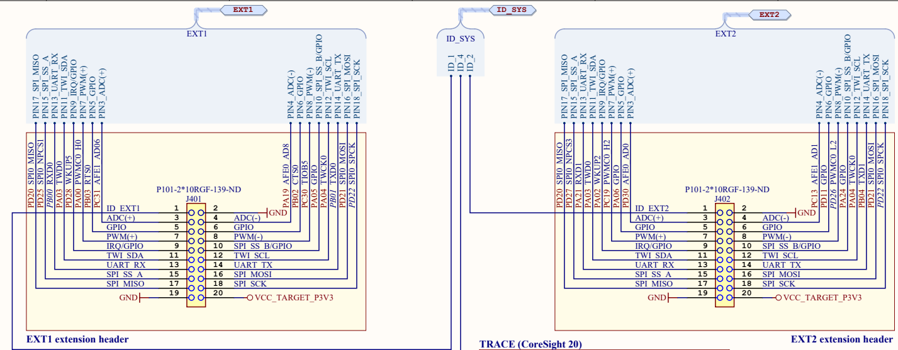

# SAMV71 Tutorial

This is a simple tutorial for SAMV71 microcontroller.

#### -- Examples -----------

##### ex1_output_pulse

An example that generates a 1-millisecond pulse from two pins of the Extension Header. It is based on the SAM V71 example project 'EDBG UART.' The 1-millisecond delay is implemented using the delay function (delay_ms)

##### ex2_output_pulse_response_to_command

An example that generates a 10-millisecond pulse from one pin of the Extension Header in response to commands entered from the terminal via serial communication

##### ex3_output_and_input_pulse

An example that outputs a high or low-level signal from one pin of the Extension Header in response to commands entered from the terminal via serial communication and reads and outputs the signal level from another pin

##### ex4_interp_timer

An example that performs interrupt processing once every second using a timer

 

#### -- General Manuals -----------

#### How to make a project

1. Connect an Evaluation board (Debug USB port) with a Windows PC. Starting with an Example Project is an easier way.
   → Atmel START example projects using this board...
   

2. This github tutorial is based on the "EDBG UART" Example.  
   Select the type of the Evaluation board (SAM V71), example project, and "Open Selected Example".
   

3. At this stage, it is possible to add the necessary modules (such as delay and Timer for interrupt processing) and configure their settings.
   
   
4. By selecting "Generate Project", the project files with C-source codes are generated.

#### Pin Assignment

Pin Assignment for Extension Header1 and 2.  
(From "SAM V71 Xplained Ultra_design_documentation_release_rev12.pdf")

　

#### Software Structure

The ASF4 peripheral driver architecture is structured to support specific use-cases for peripherals, such as PWM, timers, and input-capture, rather than providing a single driver for each type of peripheral. This architecture consists of three layers:

1. **Hardware Abstraction Layer (HAL):** This layer offers hardware-independent APIs that are common across different hardware with similar functionality. It is the primary interface for users, with functions named according to use-cases (e.g., `adc_dma_driver`). The HAL folder contains sub-folders for interface definitions (`include`), implementation of the hardware-agnostic part of the driver (`src`), documentation, and utility function drivers (`utils`).

2. **Hardware Proxy Layer (HPL):** This layer implements hardware-aware functionality required by the HAL, maintaining the hardware-agnostic nature of the HAL. Functions in this layer are prefixed with an underscore followed by the use-case name (e.g., `_usart_async_init()`). The HPL folder contains sub-folders for each hardware module supported by ASF4, with `.h` and `.c` files implementing the HPL layer.

3. **Hardware Register Interface (HRI):** This layer is used for configuring register bits or bitfields (e.g., `bit_set()`, `bit_clr()`). The HRI folder contains `.h` files for each hardware module, defining the register interface.

The purpose of implementing drivers in layers is to provide software interfaces that are abstracted from the underlying implementation, facilitate documentation, enable the coexistence of stable and unstable APIs, and separate hardware support code from reusable common code. Users are primarily intended to interact with the HAL layer, with the HPL and HRI layers being largely transparent but available for use.

The details of the software structure are descrived below:  
https://onlinedocs.microchip.com/pr/GUID-2A8AADED-413E-4021-AF0C-D99E61B8160D-en-US-4/index.html?GUID-1051C71D-4C07-406C-ACCE-BFE886294818

File Tree (ex1_output_pulse)  
ex1_output_pulse/  
├─.atmelstart  
├─Default.xml  
├─ex1_output_pulse.componentinfo.xml  
├─ex1_output_pulse.cproj  
├─Config/  
├─Debug/  
├─Device_Startup/  
├─documentation/  
├─examples/  
├─hal/: Hardware Abstraction Layer  
├─hpl/: Hardware Proxy Layer  
├─hri/: Hardware Register Interface  
├─atmel_start_pins.h: Pin MUX mappings as made by the user inside Atmel START  
├─atmel_start.c: Code for initializing MCU, drivers, and middleware in the project  
├─atmel_start.h: API for initializing MCU, drivers, and middleware in the project  
├─driver_init.c: Code for initializing drivers  
├─driver_init.h: API for initializing drivers  
└─main.c: main program (Codes to be edited mainly)

#### References

##### Evaluation Board:

SAMV71 Xplained Ultra Evaluation Kit
https://www.microchip.com/en-us/development-tool/atsamv71-xult

##### Software:

Microchip Studio
https://www.microchip.com/en-us/tools-resources/develop/microchip-studio

TeraTerm (Serial Communication for Windows)  
https://teratermproject.github.io/index-en.html

##### Manual:

ASF4 API Reference Manual
https://ww1.microchip.com/downloads/en/devicedoc/50002633a.pdf
