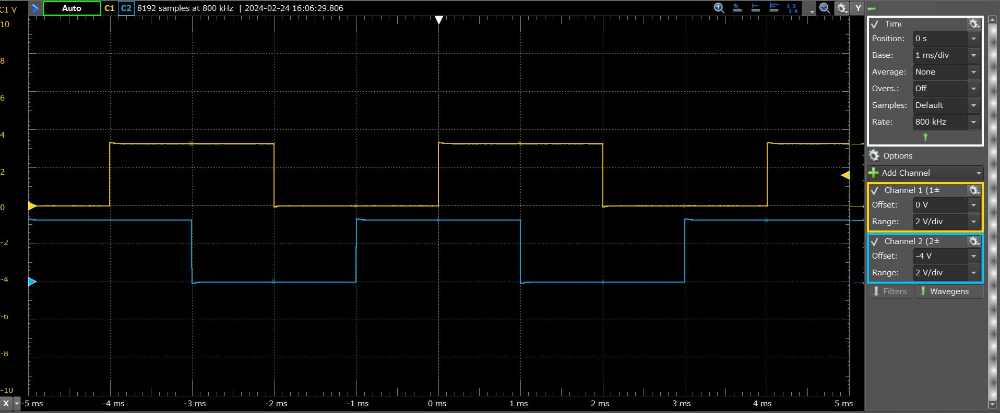

## Ex1: Output Pulse

This project is an example that generates a 1-millisecond pulse from two pins of the Extension Header. It is based on the SAM V71 example project 'EDBG UART.' The 1-millisecond delay is implemented using the delay function (delay_ms), but it is important to note that the delay driver must be added during Atmel START to ensure proper operation.

##### Main Source Code

```c
// main.c
#define PIN_PULSE GPIO(GPIO_PORTA, 6) // Port A6
#define PIN_PULSE2 GPIO(GPIO_PORTC, 19) // Port C19

int main(void)
{
	atmel_start_init();
	gpio_set_pin_direction(PIN_PULSE, GPIO_DIRECTION_OUT); // Output Pulse
	gpio_set_pin_direction(PIN_PULSE2, GPIO_DIRECTION_OUT); // Output Pulse

	while (1) {
		gpio_set_pin_level(PIN_PULSE, true);  // Set level H for Port A6
		delay_ms(1); // wait 1 ms (delay driver should be included)
		gpio_set_pin_level(PIN_PULSE2, true); // Set level H for Port C19
		delay_ms(1);
		gpio_set_pin_level(PIN_PULSE, false);  // Set level L for Port A6
		delay_ms(1);
		gpio_set_pin_level(PIN_PULSE2, false);  // Set level L for Port C19
		delay_ms(1);
	}
}
```

##### Results Output

<span style="color: Orange; ">Channel 1</span>: Port A6 (Extension2 #5)
<span style="color: Blue; ">Channel 2</span>: Port C19 (Extension2 #7)

