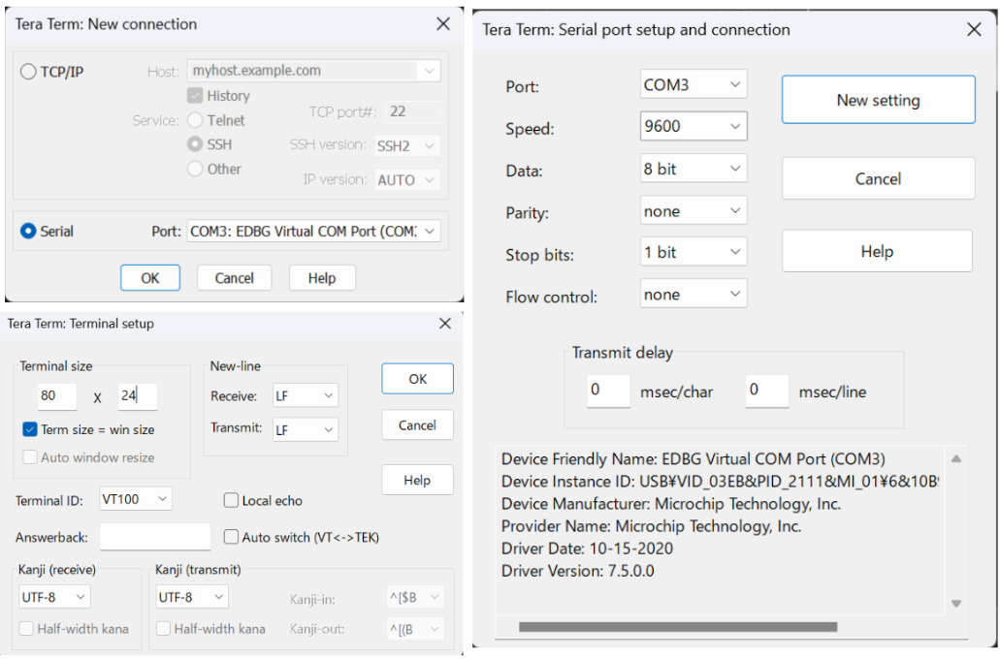

## Ex2: Output Pulse Response to Command from a Terminal

This project is an example that generates a 1-millisecond pulse from two pins of the Extension Header. It is based on the SAM V71 example project 'EDBG UART.' The 1-millisecond delay is implemented using the delay function (delay_ms), but it is important to note that the delay driver must be added during Atmel START to ensure proper operation.

##### Setup Serial Communication using TeraTerm



##### Main Source Code

```c
// main.c

#define PIN_PULSE GPIO(GPIO_PORTA, 6)

int main(void)
{
	uint8_t recv_char;
	atmel_start_init();

	usart_async_register_callback(&EDBG_COM, USART_ASYNC_TXC_CB, tx_cb_EDBG_COM);
	usart_async_register_callback(&EDBG_COM, USART_ASYNC_RXC_CB, rx_cb_EDBG_COM);
	usart_async_register_callback(&EDBG_COM, USART_ASYNC_ERROR_CB, err_cb_EDBG_COM);
	usart_async_enable(&EDBG_COM);

	io_write(&EDBG_COM.io, start_message, 13);
	gpio_set_pin_direction(PIN_PULSE, GPIO_DIRECTION_OUT);

	while (1) {
		io_write(&EDBG_COM.io, "Input: ", 7);
		uint8_t flag_input = get_char();
		if(flag_input == '1'){
			print("\r\n");
			io_write(&EDBG_COM.io, "ON!", 3);
			gpio_set_pin_level(PIN_PULSE, true);
			delay_ms(10);
			gpio_set_pin_level(PIN_PULSE, false);
		}
		print("\r\n");
	}
}
```

##### Results Output

<span style="color: Orange; ">Channel 1</span>: Port A6 (Extension2 #5)

