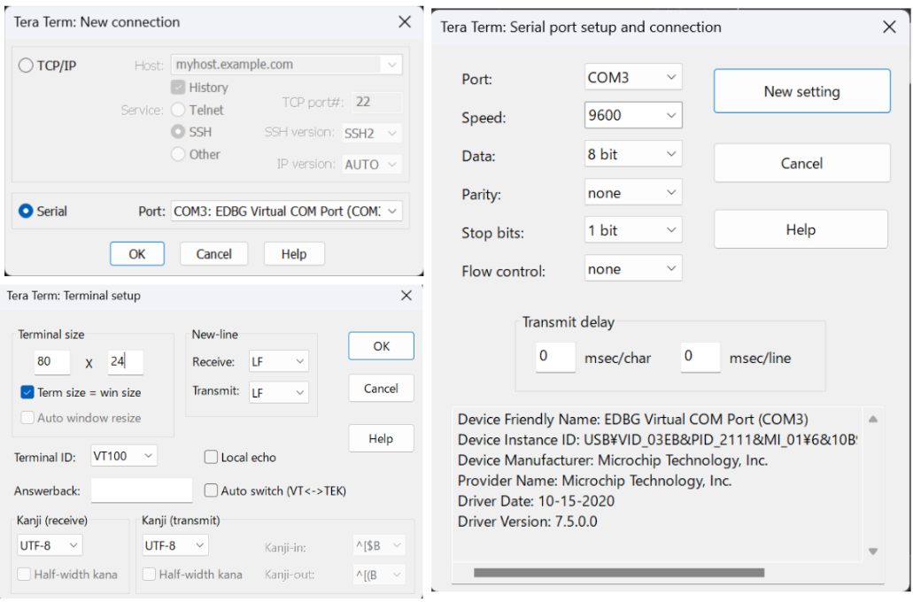
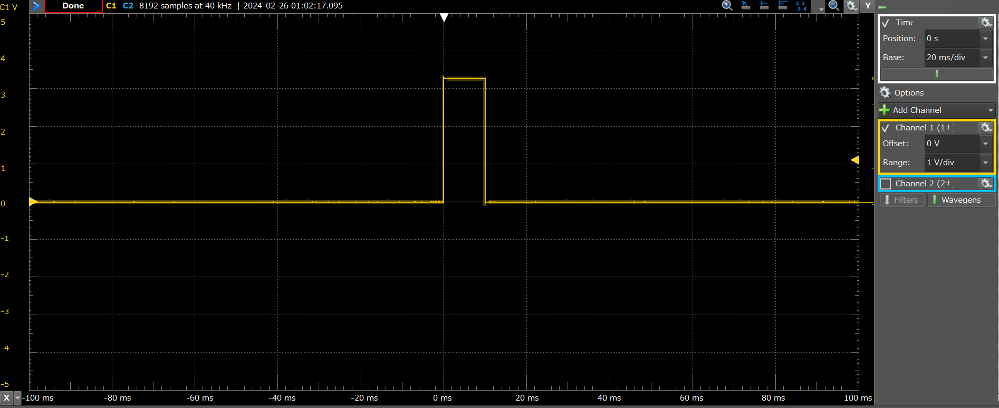
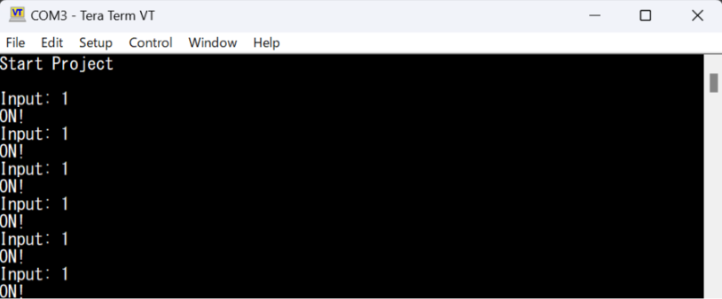

## Ex2: Output Pulse Response to Command from a Terminal

This project is an example that generates a 10-millisecond pulse from one pin of the Extension Header in response to commands entered from the terminal via serial communication. It is based on the SAM V71 example project 'EDBG UART.' Similar to Example 1, the 10-millisecond delay is implemented using the delay function (delay_ms), and it is necessary to add the delay driver during Atmel START.

### Setup Serial Communication using TeraTerm

There are several methods for serial communication, but for Windows, using TeraTerm is simple. Install and launch TeraTerm, and then configure the serial communication settings as shown in the following screen.


Serial Communication also can be done using Extension2 head pins:  
RXD: PA21 (Extension2 #13)  
TXD: PB4 (Extension2 #14)

### Main Source Code

```c
// main.c

#define PIN_PULSE GPIO(GPIO_PORTA, 6)

int main(void)
{
	uint8_t recv_char;
	atmel_start_init();

	usart_async_register_callback(&EDBG_COM, USART_ASYNC_TXC_CB, tx_cb_EDBG_COM); // setup for serial communication
	usart_async_register_callback(&EDBG_COM, USART_ASYNC_RXC_CB, rx_cb_EDBG_COM);
	usart_async_register_callback(&EDBG_COM, USART_ASYNC_ERROR_CB, err_cb_EDBG_COM);
	usart_async_enable(&EDBG_COM);

	io_write(&EDBG_COM.io, start_message, 13);
	gpio_set_pin_direction(PIN_PULSE, GPIO_DIRECTION_OUT);

	while (1) {
		io_write(&EDBG_COM.io, "Input: ", 7);
		uint8_t flag_input = get_char(); // input from terminal
		if(flag_input == '1'){
			print("\r\n");
			io_write(&EDBG_COM.io, "ON!", 3);
			gpio_set_pin_level(PIN_PULSE, true);
			delay_ms(10);
			gpio_set_pin_level(PIN_PULSE, false);
		}
		print("\r\n");
	}
}
```

### Results Output

<span style="color: Orange; ">Channel 1</span>: Port A6 (Extension2 #5)  
When entering the command "1" from Terminal (TeraTerm):



