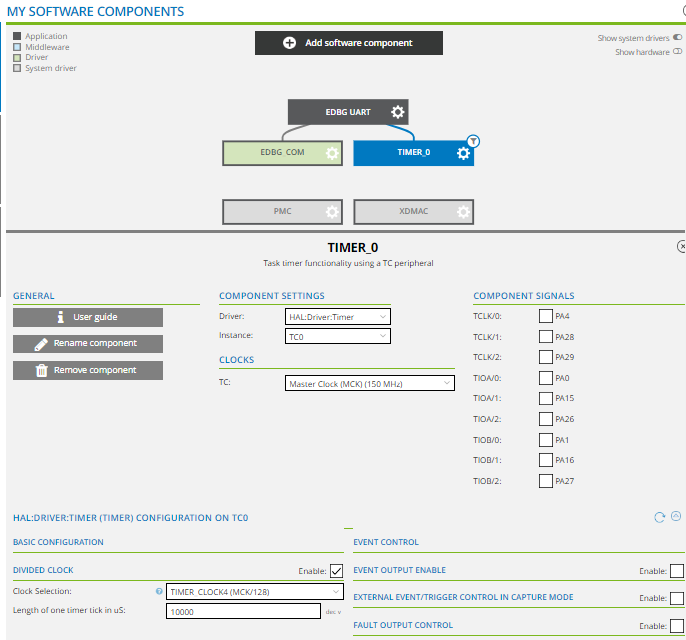
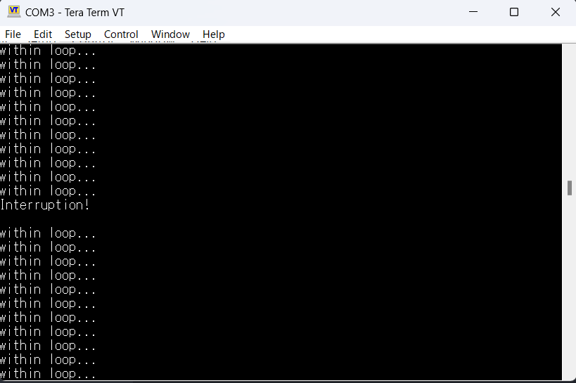

## Ex4: Timer Interruption

This project is an example that performs interrupt processing once every second using a timer. It is based on the SAM V71 example project 'EDBG UART.' Similar to Example 2, it requires setting up serial communication using TeraTerm. To implement interrupts, it is necessary to add the Timer driver in Atmel START. The configuration should be done as shown in the following screen.


### Main Source Code

```c
// main.c
struct timer_descriptor       TIMER_0;
volatile static struct timer_task    TIMER_0_task;

static void TIMER_0_task_cb(const struct timer_task *const timer_task){  //interruption action
	io_write(&EDBG_COM.io, "\r\nInterruption!\r\n", 21);
}

int main(void)
{
	uint8_t recv_char;

	atmel_start_init();

	usart_async_register_callback(&EDBG_COM, USART_ASYNC_TXC_CB, tx_cb_EDBG_COM);
	usart_async_register_callback(&EDBG_COM, USART_ASYNC_RXC_CB, rx_cb_EDBG_COM);
	usart_async_register_callback(&EDBG_COM, USART_ASYNC_ERROR_CB, err_cb_EDBG_COM);
	usart_async_enable(&EDBG_COM);

	io_write(&EDBG_COM.io, start_message, 13);
	print("\r\n");

	TIMER_0_task.interval = 100;  // define interruption interval (10ms*100=1s)
	TIMER_0_task.cb = TIMER_0_task_cb;
	TIMER_0_task.mode = TIMER_TASK_REPEAT;
	timer_add_task(&TIMER_0, &TIMER_0_task);
	timer_start(&TIMER_0);

	while (1) {
		print("within loop...\r\n");
	}
}
```

### Results Output

The message "Interruption!" will be appear in the terminal (TeraTerm) once every second.

